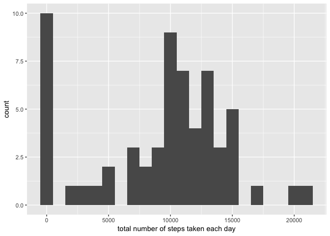
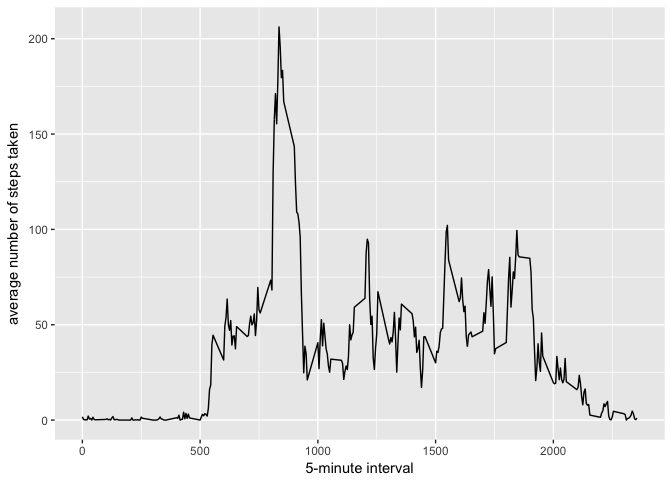
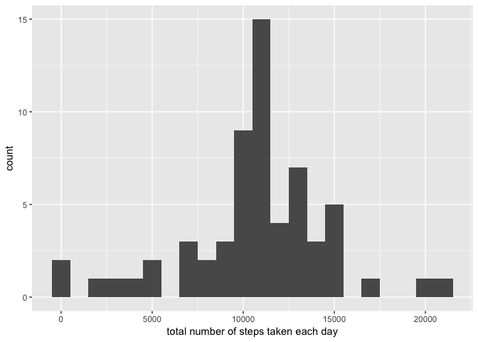
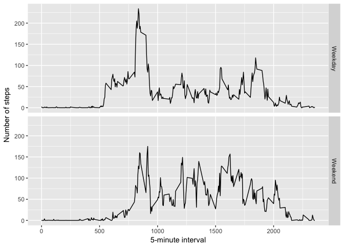

# Reproducible Research: Peer Assessment 1

## Loading and preprocessing the data

```r
unzip(zipfile="/Users/jatin/activity.zip",exdir="/Users/jatin/")
df <- read.csv("/Users/jatin/activity.csv")
```

## What is mean total number of steps taken per day?

```r
library(ggplot2)
library(dplyr)
```

```
## 
## Attaching package: 'dplyr'
```

```
## The following objects are masked from 'package:stats':
## 
##     filter, lag
```

```
## The following objects are masked from 'package:base':
## 
##     intersect, setdiff, setequal, union
```

```r
c <- df%>%group_by(date)%>%summarise(co=sum(steps,na.rm=TRUE))
qplot(c$co, binwidth=1000, xlab="total number of steps taken each day")
```

<!-- -->

```r
mean(c$co,na.rm=TRUE)
```

```
## [1] 9354.23
```

```r
median(c$co,na.rm=TRUE)
```

```
## [1] 10395
```

## What is the average daily activity pattern?

```r
library(ggplot2)
avg <- df%>%group_by(interval)%>%summarise(co=mean(steps,na.rm=TRUE))
ggplot(data=avg, aes(x=interval, y=co)) +
  geom_line() +
  xlab("5-minute interval") +
  ylab("average number of steps taken")
```

<!-- -->

On average across all the days in the dataset, the 5-minute interval contains
the maximum number of steps?

```r
avg[which.max(avg$co),]
```

```
## # A tibble: 1 x 2
##   interval    co
##      <int> <dbl>
## 1      835  206.
```

## Imputing missing values

There are many days/intervals where there are missing values (coded as `NA`). The presence of missing days may introduce bias into some calculations or summaries of the data.


```r
missing <- is.na(df$steps)
# How many missing
table(missing)
```

```
## missing
## FALSE  TRUE 
## 15264  2304
```

All of the missing values are filled in with mean value for that 5-minute
interval.


```r
# Replace each missing value with the mean value of its 5-minute interval
df1 <- df%>%rowwise()%>%
  mutate(steps=ifelse(is.na(steps),avg[avg$interval==interval,"co"],steps))%>% data.frame()
df1$steps <- as.numeric(df1$steps)
```
Now, using the filled data set, let's make a histogram of the total number of steps taken each day and calculate the mean and median total number of steps.


```r
total.steps <- df1%>%group_by(date)%>%summarise(co=sum(steps,na.rm=TRUE))
qplot(total.steps$co, binwidth=1000, xlab="total number of steps taken each day")
```

<!-- -->

```r
mean(total.steps$co)
```

```
## [1] 10766.19
```

```r
median(total.steps$co)
```

```
## [1] 10766.19
```

Mean and median values are higher after imputing missing data. The reason is
that in the original data, there are some days with `steps` values `NA` for 
any `interval`. The total number of steps taken in such days are set to 0s by
default. However, after replacing missing `steps` values with the mean `steps`
of associated `interval` value, these 0 values are removed from the histogram
of total number of steps taken each day.

## Are there differences in activity patterns between weekdays and weekends?
First, let's find the day of the week for each measurement in the dataset. In
this part, we use the dataset with the filled-in values.


```r
df$weekendorweekday <- ifelse(weekdays(as.Date(df1$date)) %in% c("Monday", "Tuesday", "Wednesday", "Thursday", "Friday"),"Weekday","Weekend")
```

Now, let's make a panel plot containing plots of average number of steps taken
on weekdays and weekends.

```r
sum_int <- df%>%group_by(interval,weekendorweekday)%>%summarise(sumsteps=mean(steps,na.rm=TRUE))
ggplot(sum_int, aes(interval, sumsteps)) + geom_line() + facet_grid(weekendorweekday ~ .) +
  xlab("5-minute interval") + ylab("Number of steps")
```

<!-- -->
