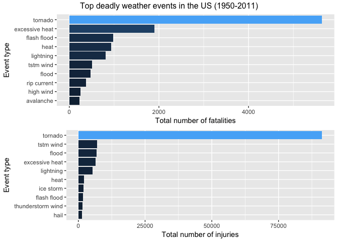
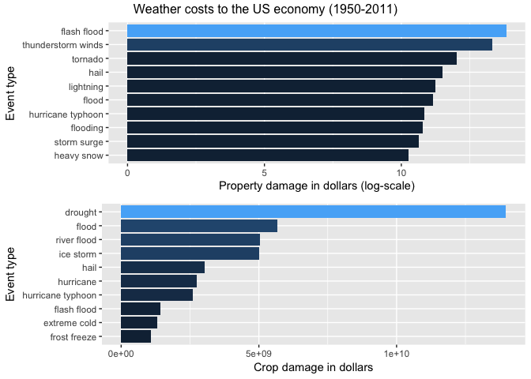

Health and Economic Impact of Weather Events in the US
======================================================


Storms and other severe weather events can cause both public health and economic
problems for communities and municipalities. Many severe events can result in
fatalities, injuries, and property damage, and preventing such outcomes to the extent
possible is a key concern.

This project involves exploring the U.S. National Oceanic and Atmospheric
Administration's (NOAA) storm database. This database tracks characteristics of major
storms and weather events in the United States, including when and where they occur, as
well as estimates of any fatalities, injuries, and property damage.

Synopsis
========

The analysis on the storm event database revealed that tornadoes are the most
dangerous weather event to the population health. The second most dangerous
event type is the excessive heat. The economic impact of weather events was
also analyzed. Flash floods and thunderstorm winds caused billions of dollars
in property damages between 1950 and 2011. The largest crop damage caused by
drought, followed by flood and hails.


Data Processing
===============

The analysis was performed on
[Storm Events Database](http://www.ncdc.noaa.gov/stormevents/ftp.jsp), provided by
[National Climatic Data Center](http://www.ncdc.noaa.gov/). The data is from a comma-separated-value file available
[here](https://d396qusza40orc.cloudfront.net/repdata%2Fdata%2FStormData.csv.bz2).
There is also some documentation of the data available
[here](https://d396qusza40orc.cloudfront.net/repdata%2Fpeer2_doc%2Fpd01016005curr.pdf).

The first step is to read the data into a data frame.

```r
df <- read.csv(bzfile("/Users/jatin/Desktop/storm.bz2"))
```

Before the analysis, the data need some preprocessing. Event types don't have a
specific format. For instance, there are events with types `Frost/Freeze`,
`FROST/FREEZE` and `FROST\\FREEZE` which obviously refer to the same type of
event.


```r
# number of unique event types
length(unique(df$EVTYPE))
```

```
## [1] 985
```

```r
# translate all letters to lowercase
event_types <- tolower(df$EVTYPE)
# replace all punct. characters with a space
event_types <- gsub("[[:blank:][:punct:]+]", " ", event_types)
length(unique(event_types))
```

```
## [1] 874
```

```r
# update the data frame
df$EVTYPE <- event_types
```

No further data preprocessing was performed although the event type field can be
processed further to merge event types such as `tstm wind` and `thunderstorm wind`. 
After the cleaning, as expected, the number of unique event types reduce
significantly. For further analysis, the cleaned event types are used.


Dangerous Events with respect to Population Health
================================================

To find the event types that are most harmful to population health, the number
of casualties are aggregated by the event type.


```r
library(dplyr)
```

```
## 
## Attaching package: 'dplyr'
```

```
## The following objects are masked from 'package:stats':
## 
##     filter, lag
```

```
## The following objects are masked from 'package:base':
## 
##     intersect, setdiff, setequal, union
```

```r
casual <- df%>%group_by(EVTYPE)%>%summarize(fatalities = sum(FATALITIES),
                                            injuries = sum(INJURIES))

# Find events that caused most death and injury
fatal_events <- head(casual[order(casual$fatalities, decreasing = T), ], 10)
injury_events <- head(casual[order(casual$injuries, decreasing = T), ], 10)
```

Top 10 events that caused largest number of deaths are


```r
fatal_events[, c("EVTYPE", "fatalities")]
```

```
## # A tibble: 10 x 2
##    EVTYPE         fatalities
##    <chr>               <dbl>
##  1 tornado              5633
##  2 excessive heat       1903
##  3 flash flood           978
##  4 heat                  937
##  5 lightning             816
##  6 tstm wind             504
##  7 flood                 470
##  8 rip current           368
##  9 high wind             248
## 10 avalanche             224
```

Top 10 events that caused most number of injuries are


```r
injury_events[, c("EVTYPE", "injuries")]
```

```
## # A tibble: 10 x 2
##    EVTYPE            injuries
##    <chr>                <dbl>
##  1 tornado              91346
##  2 tstm wind             6957
##  3 flood                 6789
##  4 excessive heat        6525
##  5 lightning             5230
##  6 heat                  2100
##  7 ice storm             1975
##  8 flash flood           1777
##  9 thunderstorm wind     1488
## 10 hail                  1361
```

Economic Effects of Weather Events
==================================

To analyze the impact of weather events on the economy, available property
damage and crop damage reportings/estimates were used.

In the raw data, the property damage is represented with two fields, a number
`PROPDMG` in dollars and the exponent `PROPDMGEXP`. Similarly, the crop damage
is represented using two fields, `CROPDMG` and `CROPDMGEXP`. The first step in the
analysis is to calculate the property and crop damage for each event.


```r
exp_transform <- function(e) {
    # h -> hundred, k -> thousand, m -> million, b -> billion
    if (e %in% c('h', 'H'))
        return(2)
    else if (e %in% c('k', 'K'))
        return(3)
    else if (e %in% c('m', 'M'))
        return(6)
    else if (e %in% c('b', 'B'))
        return(9)
    else if (!is.na(as.numeric(e))) # if a digit
        return(as.numeric(e))
    else if (e %in% c('', '-', '?', '+'))
        return(0)
    else {
        stop("Invalid exponent value.")
    }
}
```


```r
prop_dmg_exp <- sapply(df$PROPDMGEXP, FUN=exp_transform)
df$prop_dmg <- df$PROPDMG * (10 ** prop_dmg_exp)
crop_dmg_exp <- sapply(df$CROPDMGEXP, FUN=exp_transform)
df$crop_dmg <- df$CROPDMG * (10 ** crop_dmg_exp)
```


```r
# Compute the economic loss by event type
library(dplyr)

econ_loss <- df%>% group_by(EVTYPE)%>%summarize(prop_dmg = sum(prop_dmg),
                                               crop_dmg = sum(crop_dmg))

# filter out events that caused no economic loss
econ_loss <- econ_loss[(econ_loss$prop_dmg > 0 | econ_loss$crop_dmg > 0), ]
prop_dmg_events <- head(econ_loss[order(econ_loss$prop_dmg, decreasing = T), ], 10)
crop_dmg_events <- head(econ_loss[order(econ_loss$crop_dmg, decreasing = T), ], 10)
```

Top 10 events that caused most property damage (in dollars) are as follows


```r
prop_dmg_events[, c("EVTYPE", "prop_dmg")]
```

```
## # A tibble: 10 x 2
##    EVTYPE             prop_dmg
##    <chr>                 <dbl>
##  1 flash flood         6.82e13
##  2 thunderstorm winds  2.09e13
##  3 tornado             1.08e12
##  4 hail                3.16e11
##  5 lightning           1.73e11
##  6 flood               1.45e11
##  7 hurricane typhoon   6.93e10
##  8 flooding            5.92e10
##  9 storm surge         4.33e10
## 10 heavy snow          1.79e10
```

Similarly, the events that caused biggest crop damage are


```r
crop_dmg_events[, c("EVTYPE", "crop_dmg")]
```

```
## # A tibble: 10 x 2
##    EVTYPE               crop_dmg
##    <chr>                   <dbl>
##  1 drought           13972566000
##  2 flood              5661968450
##  3 river flood        5029459000
##  4 ice storm          5022113500
##  5 hail               3025974480
##  6 hurricane          2741910000
##  7 hurricane typhoon  2607872800
##  8 flash flood        1421317100
##  9 extreme cold       1312973000
## 10 frost freeze       1094186000
```

Results
=======

Health impact of weather events
-------------------------------

The following plot shows top dangerous weather event types.


```r
library(ggplot2)
library(gridExtra)
```

```
## 
## Attaching package: 'gridExtra'
```

```
## The following object is masked from 'package:dplyr':
## 
##     combine
```

```r
# Set the levels in order
p1 <- ggplot(data=fatal_events,
             aes(x=reorder(EVTYPE, fatalities), y=fatalities, fill=fatalities)) +
    geom_bar(stat="identity") +
    coord_flip() +
    ylab("Total number of fatalities") +
    xlab("Event type") +
    theme(legend.position="none")

p2 <- ggplot(data=injury_events,
             aes(x=reorder(EVTYPE, injuries), y=injuries, fill=injuries)) +
    geom_bar(stat="identity") +
    coord_flip() + 
    ylab("Total number of injuries") +
    xlab("Event type") +
    theme(legend.position="none")

grid.arrange(p1, p2, top="Top deadly weather events in the US (1950-2011)")
```

<!-- -->

Tornadoes cause most number of deaths and injuries among all event types. There 
are more than 5,000 deaths and more than 10,000 injuries in the last 60 years
in US, due to tornadoes. 
The other event types that are most dangerous with respect to population health
are excessive heat and flash floods.

Economic impact of weather events
---------------------------------

The following plot shows the most severe weather event types with respect to
economic cost that they have costed since 1950s.


```r
library(ggplot2)
library(gridExtra)
# Set the levels in order
p1 <- ggplot(data=prop_dmg_events,
             aes(x=reorder(EVTYPE, prop_dmg), y=log10(prop_dmg), fill=prop_dmg )) +
    geom_bar(stat="identity") +
    coord_flip() +
    xlab("Event type") +
    ylab("Property damage in dollars (log-scale)") +
    theme(legend.position="none")

p2 <- ggplot(data=crop_dmg_events,
             aes(x=reorder(EVTYPE, crop_dmg), y=crop_dmg, fill=crop_dmg)) +
    geom_bar(stat="identity") +
    coord_flip() + 
    xlab("Event type") +
    ylab("Crop damage in dollars") + 
    theme(legend.position="none")

grid.arrange(p1, p2, top="Weather costs to the US economy (1950-2011)")
```

<!-- -->

Property damages are given in logarithmic scale due to large range of values.
The data shows that flash floods and thunderstorm winds cost the largest
property damages among weather-related natural diseasters. Note that, due to
untidy nature of the available data, type `flood` and `flash flood` are
separate values and should be merged for more accurate data-driven conclusions.

The most severe weather event in terms of crop damage is the drought. In the last
half century, the drought has caused more than 10 billion dollars damage. Other
severe crop-damage-causing event types are floods and hails.


